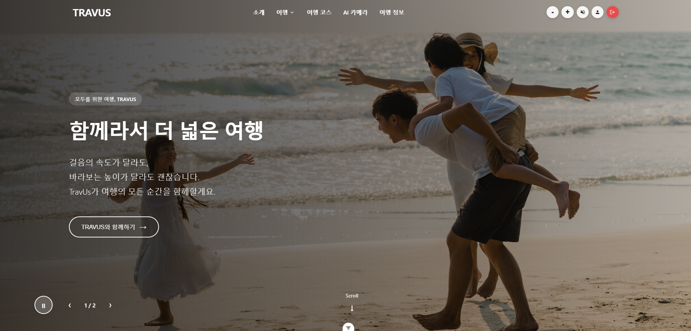

# TravUs - 모두를 위한 여행 플랫폼

TRAVUS는 "모두를 위한 여행"이라는 슬로건 아래, 장애인과 비장애인 모두가 함께 즐길 수 있는 배리어프리 여행 플랫폼입니다. 걸음의 속도가 달라도, 바라보는 높이가 달라도 모두가 편안하게 여행을 즐길 수 있도록 설계되었습니다.

## 기술 스택

### Backend
- Python 3.x
- Django 5.2 / Django REST Framework
- MySQL
- JWT 인증 (SimpleJWT)

### Frontend
- Vue 3 (Composition API)
- Vite
- Pinia (상태관리)
- Vue Router
- Axios

### 외부 API
- 한국관광공사 무장애 여행 API
- OpenAI GPT (AI 코스 생성)
- 카카오맵 API
- 네이버 검색 API
- YouTube API

## 주요 기능

### 여행지 검색
- 지역별/테마별 무장애 여행지 검색
- 상세 접근성 정보 제공 (휠체어, 시각장애, 청각장애 등)
- 북마크 기능

### AI 맞춤 코스 생성
- 지역, 기간, 테마 선택
- AI 기반 최적 여행 코스 자동 생성
- 당일치기 / 1박 2일 / 2박 3일 지원

### 코스 공유
- 사용자 생성 코스 공유
- 좋아요 및 댓글 기능
- 월간 인기 코스 30

### 사용자 기능
- 회원가입/로그인
- 마이페이지 (북마크, 내 코스, 좋아요한 코스)
- 여행지 리뷰 작성

