# TRAVUS

> 모두를 위한 여행, 모두의 여행<br>
> 무장애 여행 정보와 AI 여행 코스 추천을 제공하는 배리어프리 여행 플랫폼

🏆 **SSAFY 관통프로젝트 최우수상**

<p align="center">
  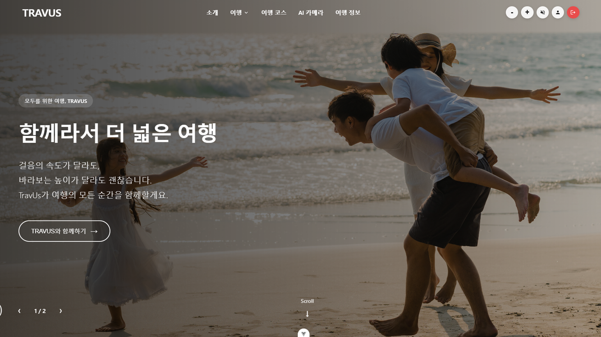
</p>

## 목차

- [프로젝트 소개](#프로젝트-소개)
- [서비스 흐름](#서비스-흐름)
- [주요 기능 및 화면](#주요-기능-및-화면)
- [핵심 구현 포인트](#핵심-구현-포인트)
- [접근성 기능](#접근성-기능)
- [기술 스택](#기술-스택)
- [프로젝트 구조](#프로젝트-구조)


## 프로젝트 소개

**TRAVUS**는 `Travel(여행)`과 `Us(우리)`를 결합한 이름으로, 장애인과 비장애인 모두가 함께 여행을 계획하고 즐길 수 있도록 만든 배리어프리 여행 서비스입니다.

여행지는 많지만, 실제로 이동하기 편한지, 휠체어 접근이 가능한지, 음성 안내나 점자블록이 있는지 같은 정보는 흩어져 있거나 찾기 어렵습니다. TRAVUS는 한국관광공사 무장애 여행 데이터를 기반으로 접근성 정보를 한곳에 모으고, AI를 활용해 여행지 설명, 후기 요약, 맞춤형 여행 코스, 카메라 기반 여행지 분석까지 제공합니다.

### 핵심 가치

- **모두를 위한 탐색**: 장애 유형과 필요한 시설 기준으로 여행지를 필터링합니다.
- **쉬운 계획**: 지역, 기간, 테마를 선택하면 AI가 여행 코스를 생성합니다.
- **현장형 안내**: 카메라와 음성 질문을 통해 여행지 정보를 더 쉽게 확인합니다.
- **공유와 기록**: 북마크, 후기, 코스 댓글, 좋아요로 여행 경험을 관리합니다.

## 서비스 흐름

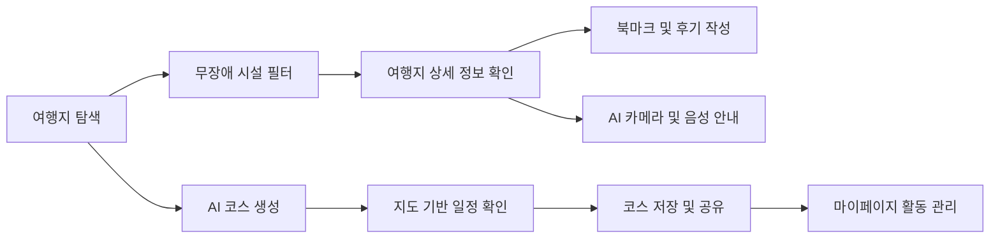
```mermaid
flowchart LR
  A["여행지 탐색"] --> B["무장애 시설 필터"]
  B --> C["여행지 상세 정보 확인"]
  C --> D["북마크 및 후기 작성"]
  A --> E["AI 코스 생성"]
  E --> F["지도 기반 일정 확인"]
  F --> G["코스 저장 및 공유"]
  G --> H["마이페이지 활동 관리"]
  C --> I["AI 카메라 및 음성 안내"]
```

## 주요 기능 및 화면

서비스의 주요 페이지를 **페이지 단위**로 나누어 정리했습니다.

각 페이지는 아래 순서로 반복됩니다.

1. 기능 설명: 해당 화면에서 제공하는 주요 기능
2. 대표 화면: 페이지 전체 흐름을 보여주는 큰 이미지
3. 세부 화면: 사용자가 실제로 확인하거나 조작하는 주요 영역

### 서비스 기능 한눈에 보기

| 기능 | 설명 |
| --- | --- |
| 무장애 여행지 검색 | 장애 유형과 편의시설 조건을 조합해 여행지, 숙소, 음식점을 탐색합니다. |
| 여행지 상세 정보 | 대표 이미지, 위치, 무장애 관광 정보, 추천 여행지, 댓글을 한 화면에서 확인합니다. |
| AI 후기 요약 | 여행지 댓글을 바탕으로 사용자가 빠르게 참고할 수 있는 후기 요약을 제공합니다. |
| AI 코스 플래너 | 지역, 기간, 테마를 입력하면 관광지, 음식점, 숙소를 조합한 여행 코스를 생성합니다. |
| 지도 기반 코스 결과 | Kakao Map 위에 일정별 마커와 동선을 표시하고 코스 저장, 공유, 댓글을 지원합니다. |
| 코스 공유 | 공개 코스를 월간 인기순, 지역별, 내가 만든 코스 기준으로 조회합니다. |
| AI 카메라 | 카메라 또는 업로드 이미지를 분석하고 텍스트/음성 질문으로 후속 안내를 제공합니다. |
| 여행 정보 통합 검색 | Naver Blog, Naver News, YouTube 결과를 한 화면에서 비교합니다. |
| 마이페이지 | 북마크, 작성 댓글, 생성 코스, 좋아요한 코스 등 사용자 활동을 관리합니다. |

### 1. 메인 홈

> 서비스 첫 진입 화면입니다. 추천 여행지와 인기 코스로 주요 탐색 흐름을 시작합니다.

#### 기능 설명

| 기능 | 설명 |
| --- | --- |
| 서비스 진입 | TRAVUS의 핵심 메시지와 주요 메뉴를 첫 화면에서 안내합니다. |
| 추천 여행지 | 사용자가 바로 탐색할 수 있도록 주요 여행지 카드를 노출합니다. |
| 인기 코스 | 다른 사용자가 만든 인기 여행 코스를 홈에서 확인할 수 있습니다. |

#### 대표 화면

<p align="center">
  
</p>
<p align="center"><b>메인 홈 전체 화면</b></p>

#### 세부 화면

| 추천 여행지 | 인기 여행 코스 |
| --- | --- |
| 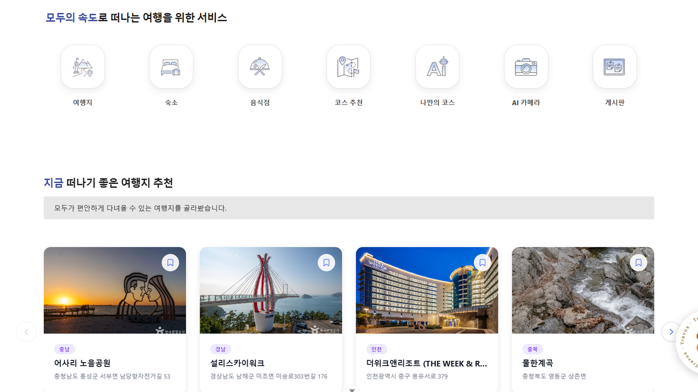 | 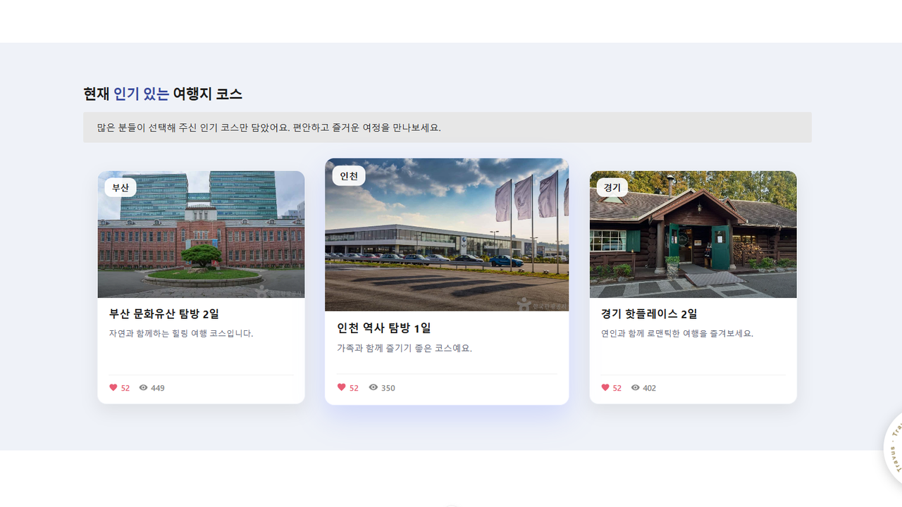 |

### 2. 서비스 소개

> TRAVUS의 서비스 방향성과 배리어프리 여행 메시지를 소개하는 화면입니다.

#### 기능 설명

| 기능 | 설명 |
| --- | --- |
| 브랜드 메시지 | `Travel`과 `Us`를 결합한 TRAVUS의 의미를 소개합니다. |
| 서비스 가치 전달 | 누구나 편하게 여행할 수 있다는 배리어프리 여행 방향성을 보여줍니다. |
| 시각적 브랜딩 | 캐릭터와 배너 이미지를 활용해 서비스의 따뜻한 분위기를 전달합니다. |

#### 대표 화면

<p align="center">
  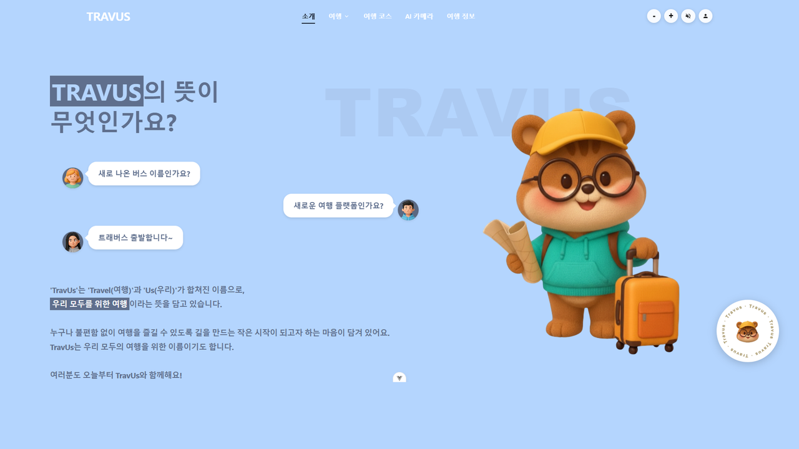
</p>
<p align="center"><b>서비스 소개 전체 화면</b></p>

#### 세부 화면

| 서비스 메시지 | 배리어프리 비주얼 |
| --- | --- |
| 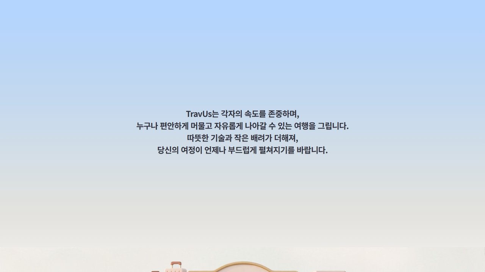 |  |

### 3. 무장애 여행지 검색

> 여행지, 숙소, 음식점을 접근성 조건과 함께 검색하는 핵심 탐색 화면입니다.

#### 기능 설명

| 기능 | 설명 |
| --- | --- |
| 카테고리 탐색 | 여행지, 숙소, 음식점을 카테고리별로 조회합니다. |
| 접근성 필터 | 지체장애, 시각장애, 청각장애, 영유아 가족, 고령자 조건을 선택합니다. |
| 시설 조건 검색 | 주차, 대중교통, 접근로, 휠체어, 엘리베이터, 화장실 등 세부 시설을 조합합니다. |
| 목록 조회 | 검색 결과를 카드형 UI와 페이지네이션으로 확인합니다. |

#### 대표 화면

<p align="center">
  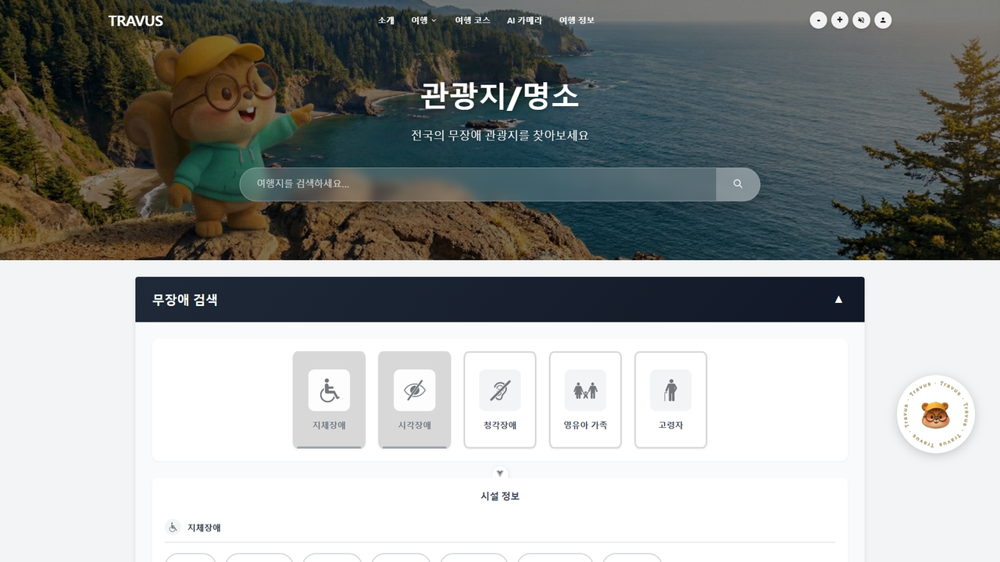
</p>
<p align="center"><b>무장애 여행지 검색 전체 화면</b></p>

#### 세부 화면

| 접근성 필터 | 여행지 목록 |
| --- | --- |
| 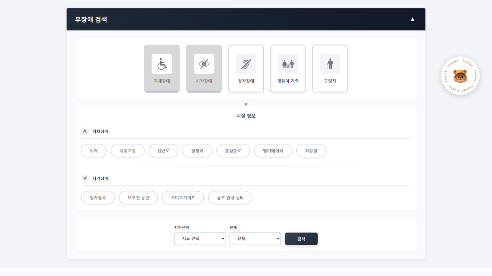 | 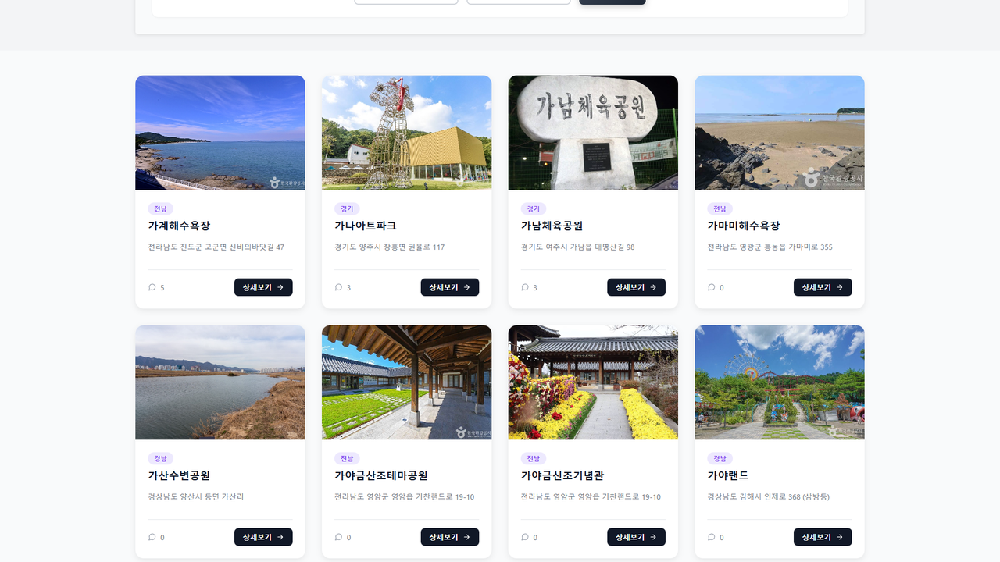 |

### 4. 여행지 상세 정보

> 선택한 여행지의 기본 정보, 지도 위치, 접근성 정보, 댓글을 한 화면에서 확인합니다.

#### 기능 설명

| 기능 | 설명 |
| --- | --- |
| 기본 정보 조회 | 여행지 대표 이미지, 주소, 분류, 지역 정보를 확인합니다. |
| 지도 위치 확인 | Kakao Map으로 여행지 위치를 시각적으로 확인합니다. |
| 무장애 정보 확인 | 접근 가능한 시설을 아이콘 활성화 상태로 보여줍니다. |
| AI 후기 요약 | 댓글 내용을 바탕으로 여행지에 대한 사용자 후기를 요약합니다. |
| 댓글 및 북마크 | 로그인 사용자가 댓글과 북마크로 여행지를 기록합니다. |

#### 대표 화면

<p align="center">
  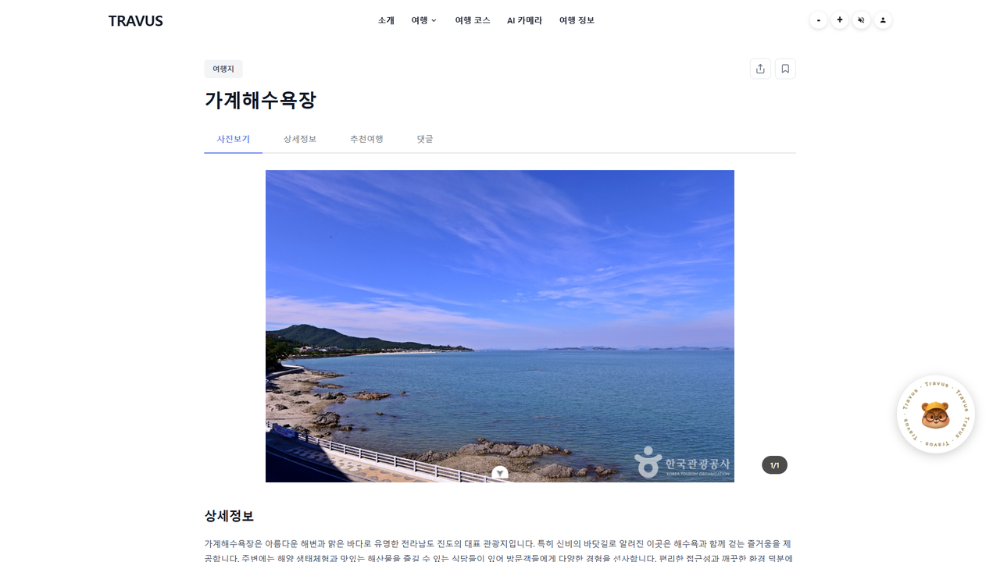
</p>
<p align="center"><b>여행지 상세 정보 전체 화면</b></p>

#### 세부 화면

| 기본 정보 및 지도 | 무장애 관광 정보 |
| --- | --- |
| 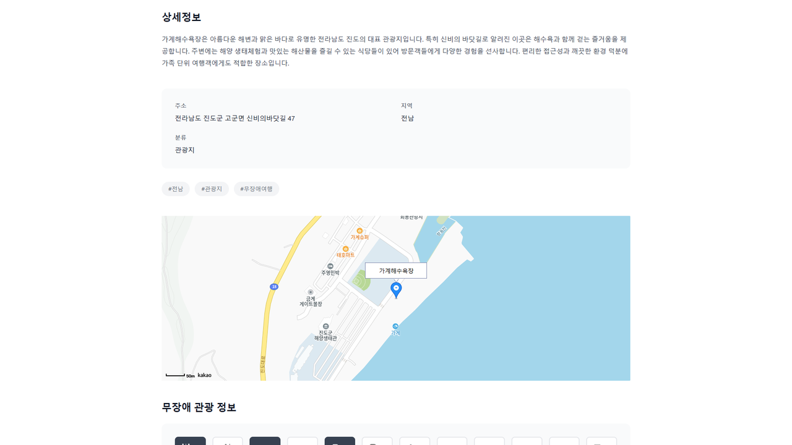 | 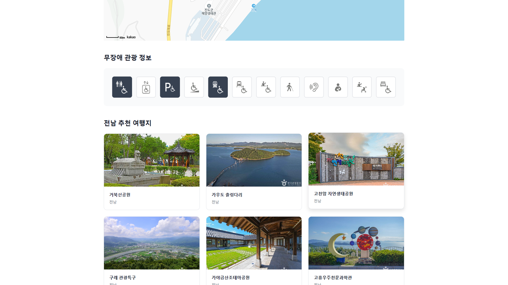 |

| AI 후기 요약 및 댓글 |
| --- |
| 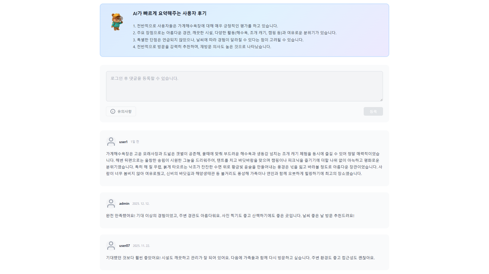 |

### 5. AI 코스 플래너

> 지역, 기간, 테마를 선택하면 AI가 일정형 여행 코스를 생성하는 화면입니다.

#### 기능 설명

| 기능 | 설명 |
| --- | --- |
| 지역 선택 | 여행할 지역을 선택해 코스 생성 범위를 정합니다. |
| 기간 선택 | 당일치기, 1박 2일, 2박 3일 중 여행 기간을 선택합니다. |
| 테마 선택 | 산, 바다, 실내여행지, 액티비티 등 원하는 여행 테마를 고릅니다. |
| AI 코스 생성 | 관광지, 음식점, 숙소 데이터를 조합해 맞춤형 일정을 생성합니다. |
| 지도 결과 확인 | 생성된 코스를 지도와 일정 리스트로 확인합니다. |

#### 대표 화면

<p align="center">
  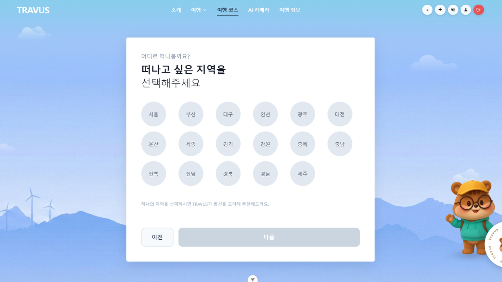
</p>
<p align="center"><b>AI 코스 플래너 전체 화면</b></p>

#### 세부 화면

| 지역 선택 | 기간 선택 | 테마 선택 |
| --- | --- | --- |
| 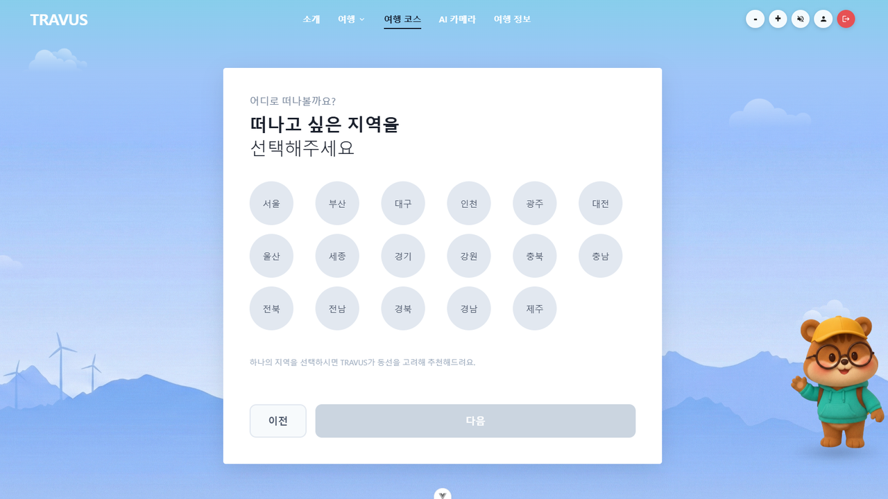 | 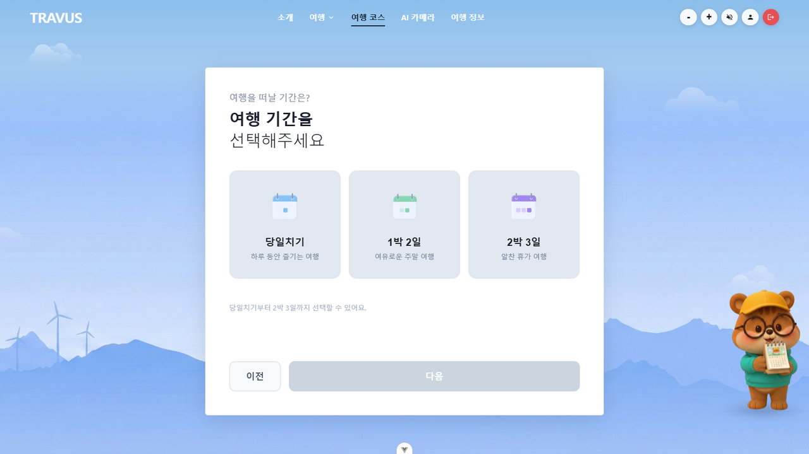 | 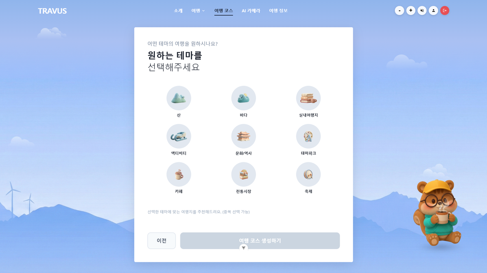 |

| 생성 로딩 | 지도 기반 코스 결과 |
| --- | --- |
| 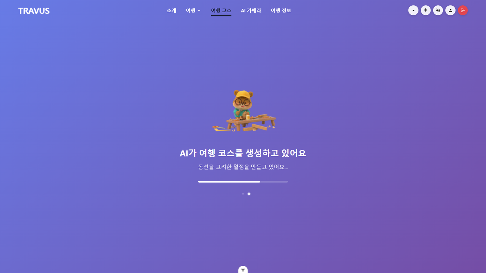 | 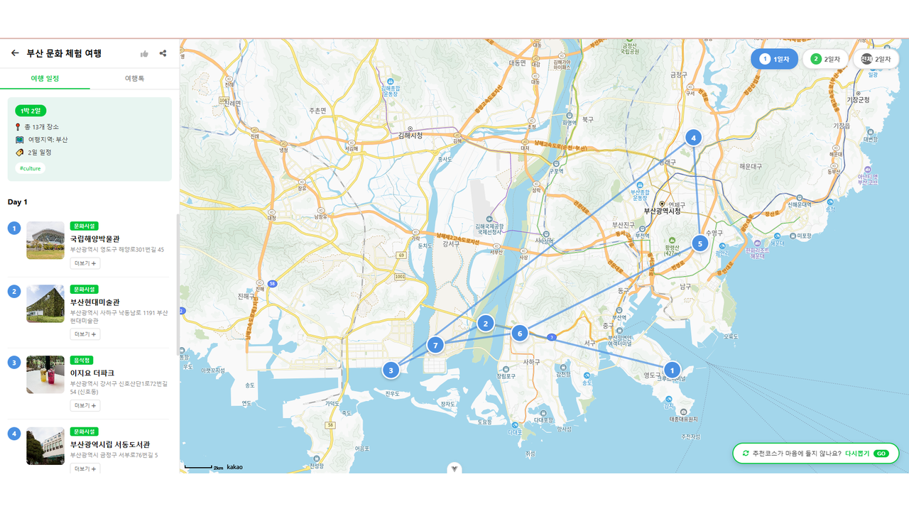 |

### 6. 코스 공유 및 인기 코스

> 공개된 여행 코스를 인기순, 지역별, 사용자별로 탐색하는 화면입니다.

#### 기능 설명

| 기능 | 설명 |
| --- | --- |
| 월간 인기 코스 | 좋아요와 조회수를 기준으로 인기 코스를 확인합니다. |
| 지역별 코스 | 공개된 사용자 코스를 지역별로 탐색합니다. |
| 내 코스 조회 | 로그인 사용자가 직접 생성한 코스를 관리합니다. |
| 코스 반응 | 공개 코스에 좋아요와 댓글을 남길 수 있습니다. |

#### 대표 화면

<p align="center">
  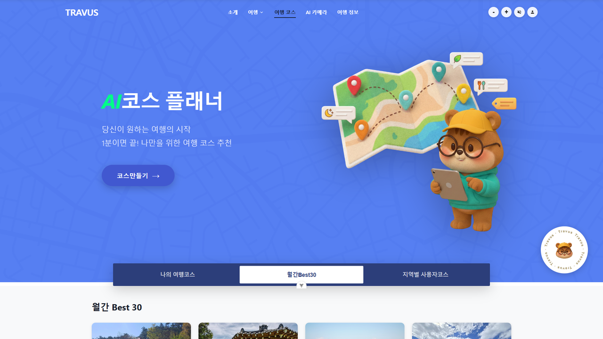
</p>
<p align="center"><b>코스 공유 및 인기 코스 전체 화면</b></p>

#### 세부 화면

| 월간 Best 30 | 공개 코스 목록 |
| --- | --- |
| 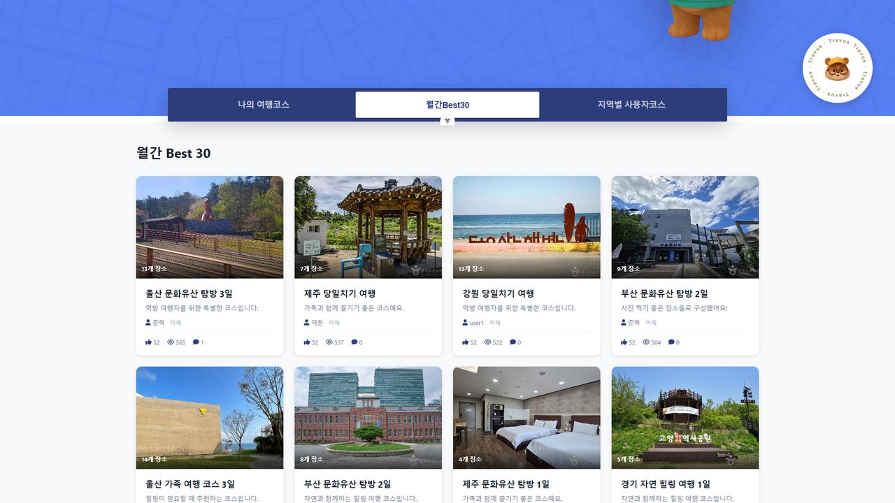 | 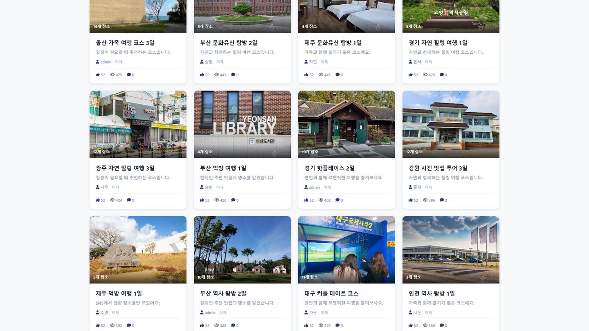 |

### 7. AI 카메라

> 카메라 또는 업로드 이미지로 여행지를 분석하고, 텍스트/음성 질문까지 이어지는 화면입니다.

#### 기능 설명

| 기능 | 설명 |
| --- | --- |
| 카메라 분석 | 실시간 카메라 또는 업로드 이미지를 AI가 분석합니다. |
| 텍스트 질문 | 분석 결과를 바탕으로 여행지에 대해 추가 질문을 할 수 있습니다. |
| 음성 질문 | 음성 녹음, STT 변환, AI 응답 흐름을 지원합니다. |
| 음성 안내 | 분석 결과와 답변을 TTS로 들을 수 있습니다. |

#### 대표 화면

<p align="center">
  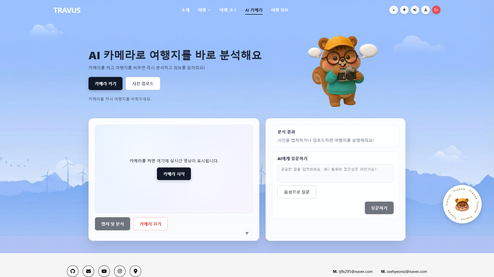
</p>
<p align="center"><b>AI 카메라 전체 화면</b></p>

### 8. 여행 정보 통합 검색

> 여행지 관련 블로그, 뉴스, 유튜브 결과를 한 화면에서 비교하는 검색 화면입니다.

#### 기능 설명

| 기능 | 설명 |
| --- | --- |
| 블로그 검색 | Naver Blog API를 통해 여행 후기와 기록을 검색합니다. |
| 뉴스 검색 | Naver News API로 최신 여행 관련 뉴스를 확인합니다. |
| 영상 검색 | YouTube Data API로 여행지 관련 영상을 조회합니다. |
| 통합 결과 | 블로그, 뉴스, 영상을 한 화면에서 비교합니다. |

#### 대표 화면

<p align="center">
  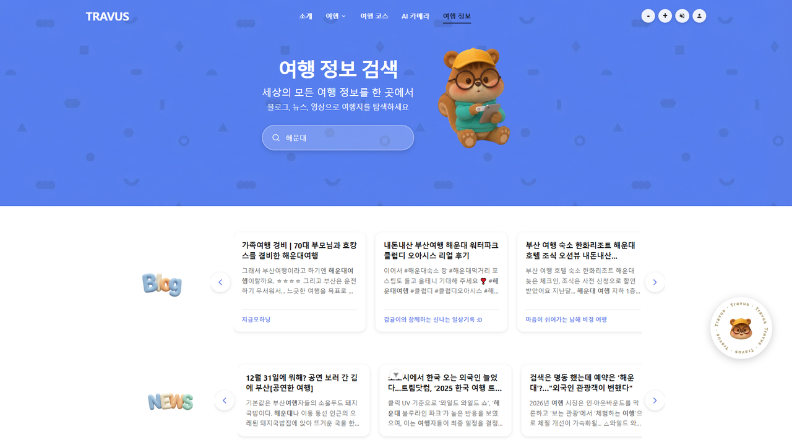
</p>
<p align="center"><b>여행 정보 통합 검색 전체 화면</b></p>

#### 세부 화면

| 블로그 및 뉴스 | 유튜브 검색 결과 |
| --- | --- |
| 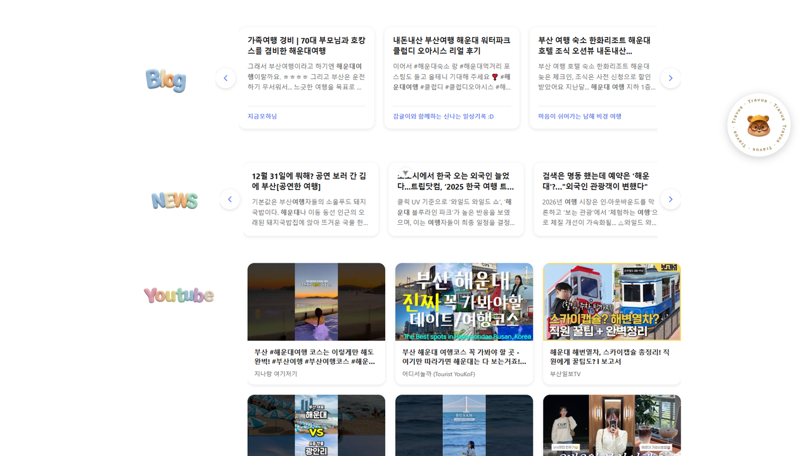 | 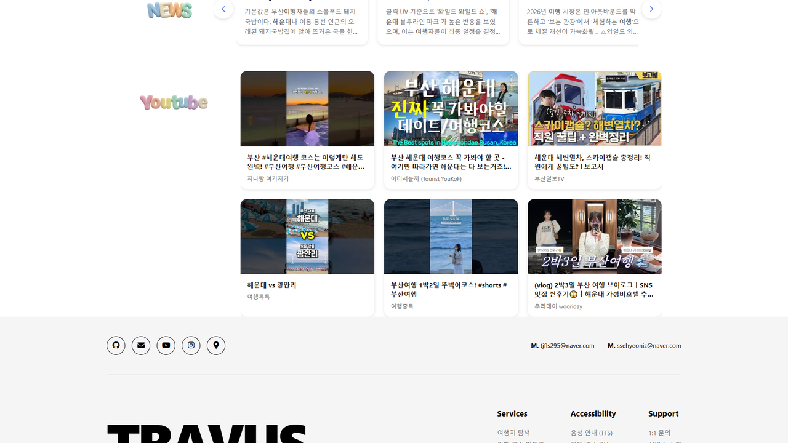 |

### 9. 마이페이지

> 사용자의 북마크, 댓글, 코스, 회원 정보를 한곳에서 관리하는 개인 활동 화면입니다.

#### 기능 설명

| 기능 | 설명 |
| --- | --- |
| 북마크 관리 | 사용자가 저장한 여행지를 지역별로 확인합니다. |
| 댓글 기록 | 여행지 댓글과 코스 댓글 작성 내역을 조회합니다. |
| 코스 관리 | 내가 만든 코스와 좋아요한 코스를 확인합니다. |
| 회원 정보 수정 | 이메일, 전화번호 등 사용자 정보를 수정합니다. |

#### 대표 화면

<p align="center">
  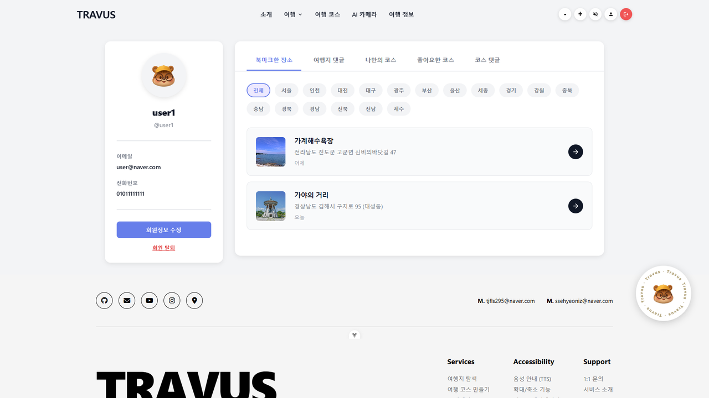
</p>
<p align="center"><b>마이페이지 전체 화면</b></p>

## 핵심 구현 포인트

화면 설명과 분리해, 기술적으로 신경 쓴 구현 내용을 따로 모았습니다.

| 영역 | 구현 포인트 | 내용 |
| --- | --- | --- |
| Data/API | 무장애 데이터 기반 검색 | 한국관광공사 무장애 여행 데이터를 활용해 여행지, 숙소, 음식점을 조회하고 장애 유형과 편의시설 조건으로 필터링합니다. |
| Detail | 여행지 상세 정보 구성 | 기본 정보, Kakao Map 위치, 접근성 아이콘, 추천 여행지, 댓글, AI 후기 요약을 한 상세 화면에 모았습니다. |
| AI | AI 코스 생성 | 지역, 기간, 테마 입력값을 바탕으로 관광지, 음식점, 숙소를 조합해 일정형 여행 코스를 생성합니다. |
| Map | 지도 기반 코스 시각화 | 생성된 코스를 Kakao Map 마커, 동선, 일정 리스트로 보여주고 저장, 공유, 댓글 흐름까지 연결합니다. |
| AI Camera | 이미지 및 음성 안내 | 이미지 분석 결과에 텍스트 질문, 음성 질문, STT, TTS 흐름을 붙여 현장에서 정보를 확인할 수 있게 했습니다. |
| Search | 통합 여행 정보 검색 | Naver Blog, Naver News, YouTube 검색 결과를 한 화면에서 비교할 수 있도록 정리했습니다. |
| User | 사용자 활동 관리 | 북마크, 댓글, 생성 코스, 좋아요한 코스, 회원 정보를 마이페이지에서 관리할 수 있게 구성했습니다. |


## 접근성 기능

TRAVUS는 서비스 주제에 맞게 사용자 인터페이스에도 접근성 기능을 반영했습니다.

- 글자 크기 확대 및 축소
- TTS(Text-to-Speech) 음성 안내
- 포커스된 버튼과 링크의 텍스트 읽기
- 키보드 포커스 스타일 제공
- 무장애 관광 정보 아이콘 시각화

## 기술 스택

### Frontend

<p>
  
  
  
  
  
  
  
  
  
</p>

| 기술 | 사용 목적 |
| --- | --- |
| Vue 3.5 | SPA 화면 구성 |
| Composition API | 상태와 로직을 컴포넌트 단위로 관리 |
| Vite 7.2 | 빠른 개발 서버 및 번들링 |
| Vue Router 4.6 | 페이지 라우팅 |
| Pinia 3.0 | 인증 상태 관리 |
| Axios 1.13 | 백엔드 API 통신 |
| GSAP 3.14 | 홈 화면 스크롤 애니메이션 |
| Kakao Map SDK | 지도, 마커, 동선 표시 |
| Web Speech API | TTS 음성 안내 |
| MediaRecorder API | 음성 질문 녹음 |

### Backend

<p>
  
  
  
  
  
  
  
  
</p>

| 기술 | 사용 목적 |
| --- | --- |
| Python 3.13 | 백엔드 개발 언어 |
| Django 5.2.4 | 서버 애플리케이션 |
| Django REST Framework 3.16.0 | REST API 구현 |
| SimpleJWT 5.3.1 | JWT 인증 |
| MySQL | 서비스 데이터 저장 |
| Redis 5.0.1 | 캐싱 확장 대비 |
| django-cors-headers 4.3.1 | 프론트엔드 CORS 허용 |
| python-dotenv 1.0.0 | 환경 변수 관리 |
| requests 2.32.4 | 외부 API 호출 |

### External API

<p>
  
  
  
  
  
  
  
</p>

| API | 사용 목적 |
| --- | --- |
| 한국관광공사 무장애 여행 API | 여행지 및 접근성 데이터 수집 |
| Kakao Map API | 지도 및 위치 표시 |
| OpenAI / SSAFY GMS | AI 코스 생성, 설명 생성, 후기 요약, 이미지 분석 |
| Whisper API | 음성 질문 STT 변환 |
| Naver Search API | 블로그, 뉴스 검색 |
| YouTube Data API | 여행 영상 검색 |

### Infra

<p>
  
  
  
</p>

| 기술 | 사용 목적 |
| --- | --- |
| AWS EC2 | 서버 배포 |
| MySQL | 운영 데이터베이스 |
| Redis | 캐싱 확장 대비 |

## 프로젝트 구조

```text
Travus
├─ README.md
├─ results
│  └─ images
│     ├─ readme
│     │  └─ screens
│     │     └─ README용 1280x720 화면 캡처 이미지
│     └─ 서비스 화면 캡처 이미지 및 아키텍처 다이어그램
├─ Backend
│  ├─ manage.py
│  ├─ requirements.txt
│  ├─ travus
│  │  ├─ settings.py
│  │  ├─ urls.py
│  │  ├─ asgi.py
│  │  └─ wsgi.py
│  ├─ accounts
│  │  ├─ models.py
│  │  ├─ serializers.py
│  │  ├─ views.py
│  │  └─ urls.py
│  ├─ api
│  │  ├─ models.py
│  │  ├─ serializers.py
│  │  ├─ views.py
│  │  ├─ services
│  │  │  ├─ tour_api.py
│  │  │  ├─ ai_course_generator.py
│  │  │  └─ ai_description_generator.py
│  │  ├─ management
│  │  │  └─ commands
│  │  │     ├─ fetch_tour_data.py
│  │  │     ├─ load_api_data.py
│  │  │     ├─ sync_detail_info.py
│  │  │     └─ create_dummy_courses.py
│  │  └─ fixtures
│  │     └─ tour_data.json
│  ├─ ai
│  │  ├─ views.py
│  │  └─ urls.py
│  └─ board
│     ├─ views.py
│     └─ urls.py
└─ Frontend
   └─ travus
      ├─ package.json
      ├─ vite.config.js
      ├─ src
      │  ├─ main.js
      │  ├─ App.vue
      │  ├─ router
      │  │  └─ index.js
      │  ├─ stores
      │  │  └─ auth.js
      │  ├─ services
      │  │  ├─ api.js
      │  │  └─ boardApi.js
      │  ├─ composables
      │  │  └─ useTTS.js
      │  ├─ views
      │  │  ├─ Home.vue
      │  │  ├─ About.vue
      │  │  ├─ TravelView.vue
      │  │  ├─ TravelDetailView.vue
      │  │  ├─ CourseView.vue
      │  │  ├─ CameraView.vue
      │  │  ├─ BoardView.vue
      │  │  ├─ LoginView.vue
      │  │  ├─ SignupView.vue
      │  │  └─ MyPageView.vue
      │  ├─ components
      │  │  ├─ common
      │  │  ├─ home
      │  │  ├─ course
      │  │  ├─ travel
      │  │  ├─ ai
      │  │  └─ about
      │  └─ assets
      │     └─ 이미지 및 아이콘 리소스
      └─ public
```
