# TRAVUS

> 모두를 위한 여행, 모두의 여행<br>
> 무장애 여행 정보와 AI 여행 코스 추천을 제공하는 배리어프리 여행 플랫폼

🏆 **SSAFY 관통프로젝트 최우수상**

<p align="center">
  
</p>

## 목차

- [프로젝트 소개](#프로젝트-소개)
- [서비스 흐름](#서비스-흐름)
- [주요 화면](#주요-화면)
- [접근성 기능](#접근성-기능)
- [기술 스택](#기술-스택)
- [시스템 아키텍처](#시스템-아키텍처)
- [프로젝트 구조](#프로젝트-구조)


## 프로젝트 소개

**TRAVUS**는 `Travel(여행)`과 `Us(우리)`를 결합한 이름으로, 장애인과 비장애인 모두가 함께 여행을 계획하고 즐길 수 있도록 만든 배리어프리 여행 서비스입니다.

여행지는 많지만, 실제로 이동하기 편한지, 휠체어 접근이 가능한지, 음성 안내나 점자블록이 있는지 같은 정보는 흩어져 있거나 찾기 어렵습니다. TRAVUS는 한국관광공사 무장애 여행 데이터를 기반으로 접근성 정보를 한곳에 모으고, AI를 활용해 여행지 설명, 후기 요약, 맞춤형 여행 코스, 카메라 기반 여행지 분석까지 제공합니다.

### 핵심 가치

- **모두를 위한 탐색**: 장애 유형과 필요한 시설 기준으로 여행지를 필터링합니다.
- **쉬운 계획**: 지역, 기간, 테마를 선택하면 AI가 여행 코스를 생성합니다.
- **현장형 안내**: 카메라와 음성 질문을 통해 여행지 정보를 더 쉽게 확인합니다.
- **공유와 기록**: 북마크, 후기, 코스 댓글, 좋아요로 여행 경험을 관리합니다.

## 서비스 흐름

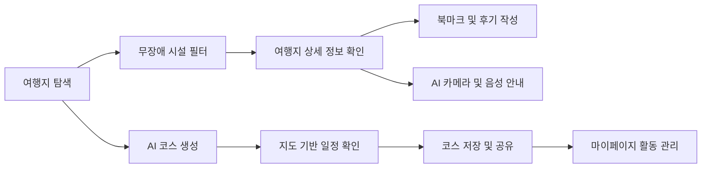

## 주요 화면

### 1. 메인 홈

TRAVUS의 핵심 서비스를 한눈에 볼 수 있는 첫 화면입니다. 서비스 바로가기, 추천 여행지, 인기 코스가 홈에서 이어집니다.

| 메인 히어로 | 추천 여행지 |
| --- | --- |
|  | 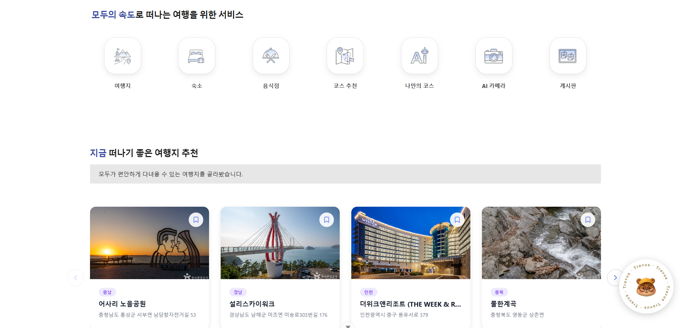 |

| 인기 여행 코스 | 푸터 |
| --- | --- |
| 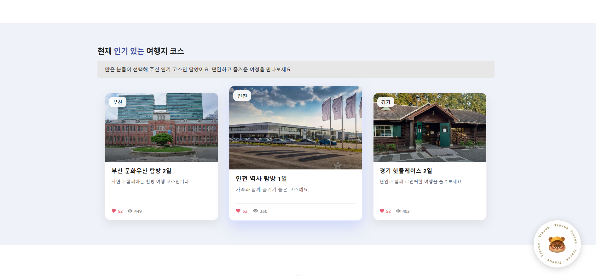 | 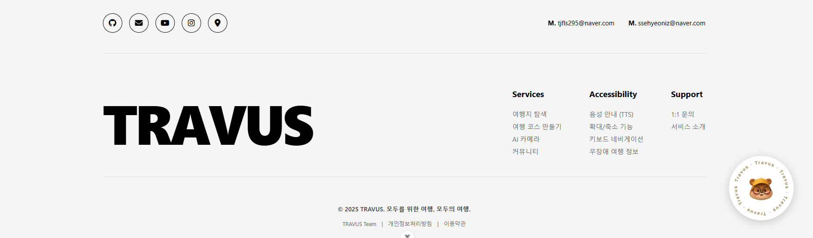 |

### 2. 서비스 소개

TRAVUS의 의미와 서비스 방향성을 소개하는 페이지입니다. 프로젝트의 배리어프리 메시지를 캐릭터와 시각 요소로 전달합니다.

<p align="center">
  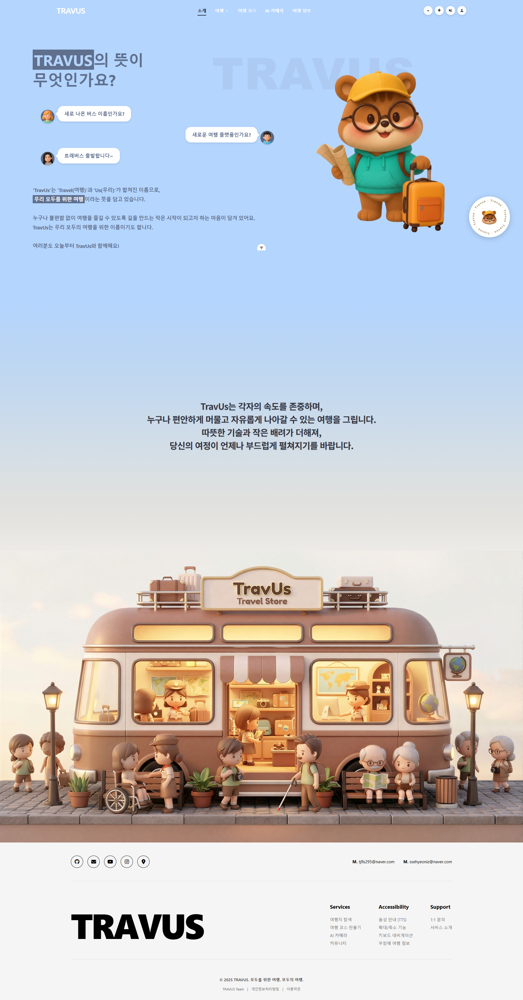
</p>

### 3. 무장애 여행지 검색

여행지, 숙소, 음식점을 카테고리별로 탐색하고, 장애 유형별 접근성 시설을 선택해 필터링할 수 있습니다.

<p align="center">
  
</p>

구현 포인트:

- 지역, 카테고리, 검색어, 정렬 조건 기반 여행지 목록 조회
- 지체장애, 시각장애, 청각장애, 영유아 가족, 고령자 유형별 시설 필터 제공
- 휠체어, 주차, 대중교통, 접근로, 승강기, 화장실, 오디오가이드 등 접근성 조건 조합 검색
- 페이지네이션과 카드형 목록 UI 제공

### 4. 여행지 상세 정보

여행지 상세 페이지에서는 대표 이미지, 기본 정보, Kakao Map 위치, 무장애 관광 정보, 추천 여행지, 댓글과 AI 후기 요약을 확인할 수 있습니다.

<p align="center">
  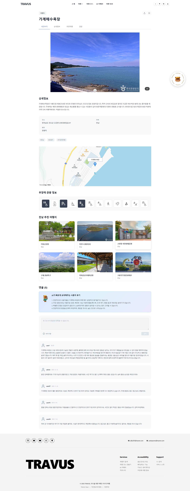
</p>

구현 포인트:

- `content_id` 기반 여행지 상세 조회
- Kakao Map SDK를 활용한 위치 표시
- 접근성 아이콘 활성화 표시
- 같은 지역의 추천 여행지 제공
- 로그인 사용자 대상 북마크 토글
- 여행지 댓글 작성, 수정, 삭제
- AI 기반 사용자 후기 요약
- 여행지 설명이 부족한 경우 AI 설명 생성

### 5. AI 코스 플래너

사용자가 지역, 여행 기간, 테마를 선택하면 AI가 관광지, 음식점, 숙소를 조합해 여행 코스를 생성합니다.

| 지역 선택 | 기간 선택 |
| --- | --- |
| 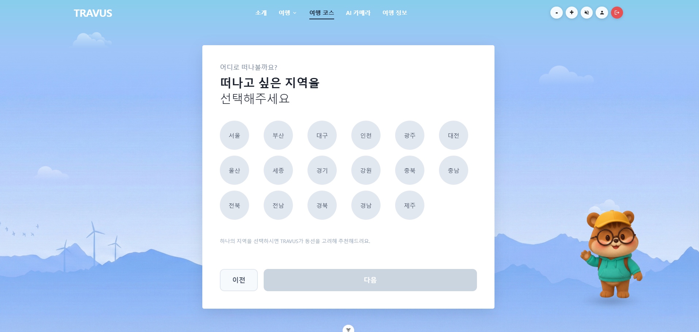 | 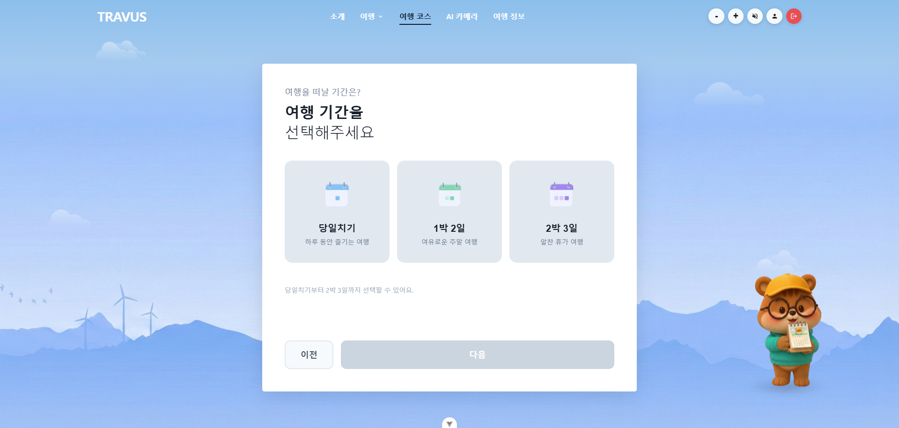 |

| 테마 선택 | 생성 로딩 |
| --- | --- |
| 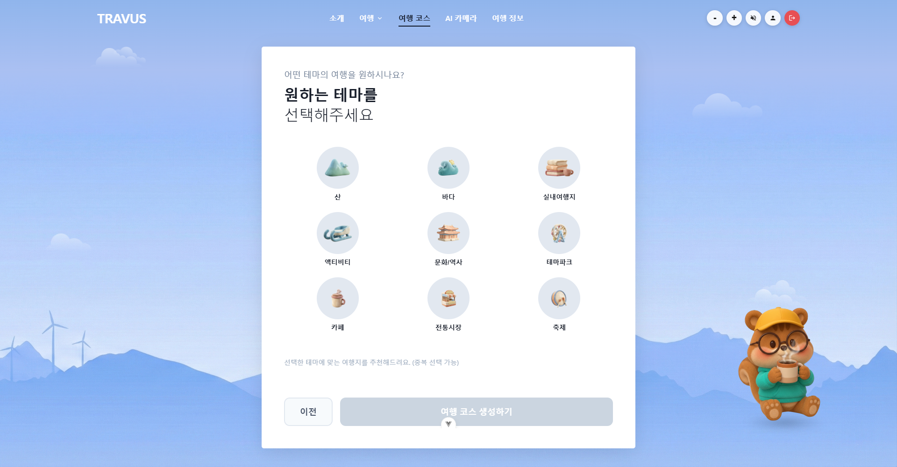 | 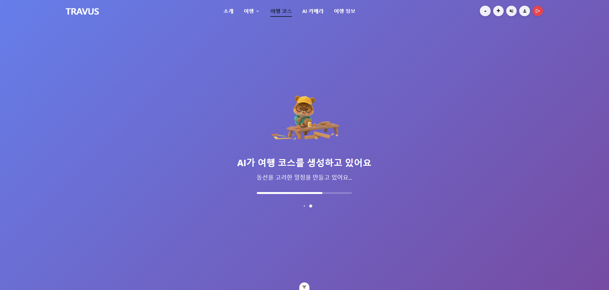 |

구현 포인트:

- 지역 선택, 기간 선택, 테마 선택을 단계형 플로우로 구성
- 당일치기, 1박 2일, 2박 3일 일정 지원
- 관광지, 음식점, 숙소 데이터를 구분해 AI 프롬프트 구성
- AI 응답의 장소 ID를 실제 DB 데이터와 검증
- 일정 생성 실패 또는 데이터 부족 상황에 대한 예외 처리

### 6. 지도 기반 코스 결과

생성된 여행 코스는 지도와 일정 리스트를 함께 보여줍니다. 날짜별 마커, 동선, 장소 상세 패널, 코스 저장, 공유, 좋아요, 댓글 기능을 제공합니다.

<p align="center">
  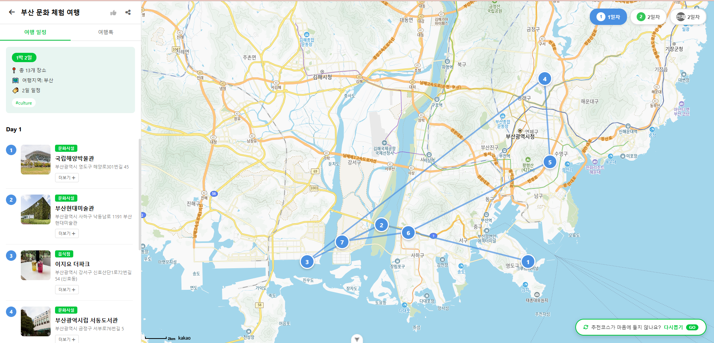
</p>

구현 포인트:

- Kakao Map 위에 일정 순서별 커스텀 마커 표시
- 날짜별 또는 전체 일정 보기 지원
- 장소 간 이동 동선을 Polyline으로 시각화
- 생성된 AI 코스를 DB에 자동 저장
- 저장된 코스 공유 URL 생성
- 코스 좋아요, 댓글 작성 및 삭제
- 기존 공개 코스 상세 조회 지원

### 7. 코스 공유 및 인기 코스

사용자들이 생성한 공개 코스를 모아 월간 Best 30, 지역별 사용자 코스, 내가 만든 코스 목록으로 보여줍니다.

<p align="center">
  
</p>

구현 포인트:

- 월간 인기 코스 30개 조회
- 좋아요와 조회수 기반 정렬
- 지역별 공개 코스 필터링
- 로그인 사용자별 내 코스 조회

### 8. AI 카메라

카메라를 켜거나 사진을 업로드하면 AI가 여행지를 분석합니다. 분석 결과를 바탕으로 텍스트 질문과 음성 질문도 할 수 있습니다.

<p align="center">
  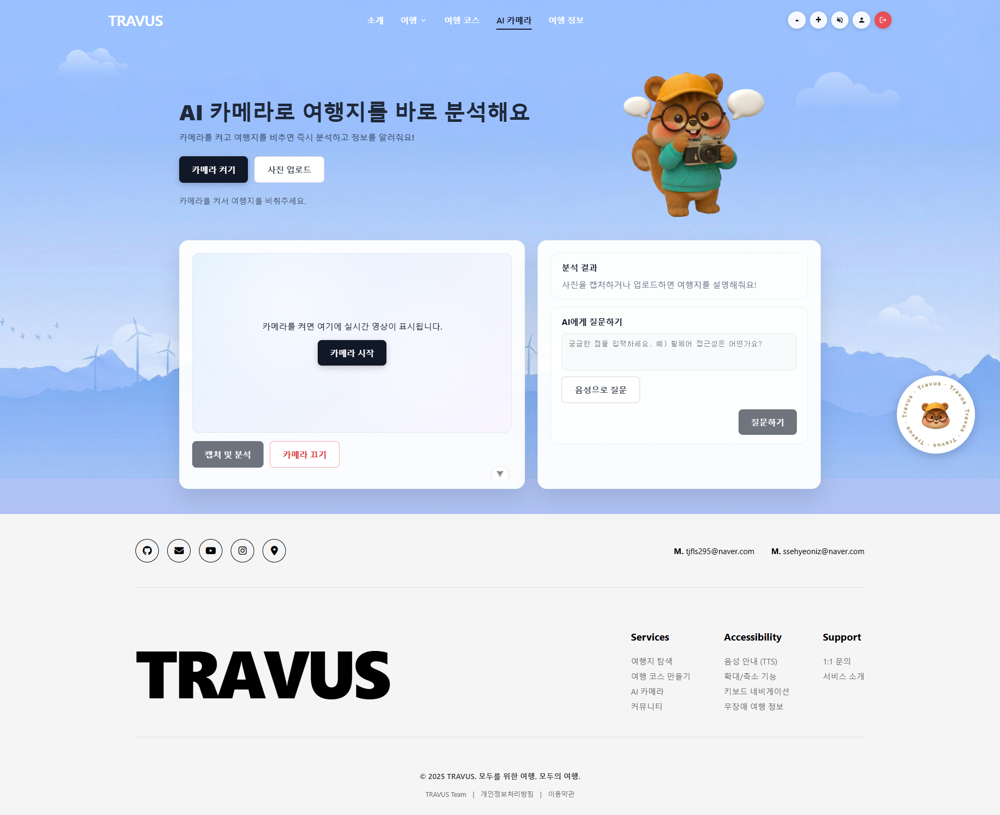
</p>

구현 포인트:

- 브라우저 `getUserMedia`로 실시간 카메라 접근
- 캡처 이미지 리사이즈 및 JPEG 압축 후 서버 전송
- OpenAI Vision 모델 기반 이미지 분석
- 분석 결과 TTS 음성 안내
- MediaRecorder 기반 음성 녹음
- Whisper STT로 음성을 텍스트로 변환
- 변환된 질문을 AI 채팅 API에 자동 전송

### 9. 여행 정보 통합 검색

여행지를 검색하면 블로그, 뉴스, 유튜브 결과를 한 화면에서 확인할 수 있습니다.

<p align="center">
  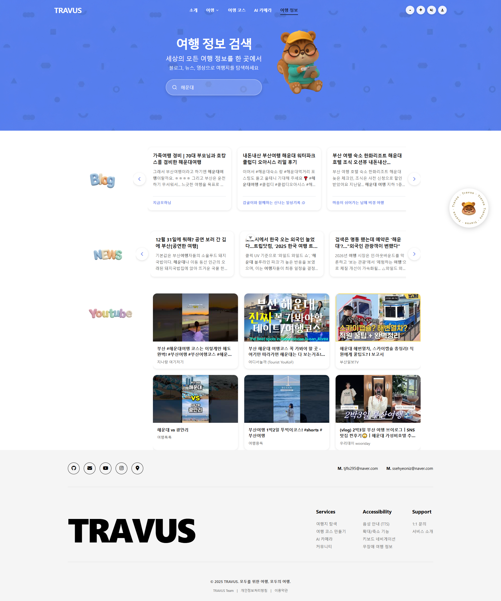
</p>

구현 포인트:

- Naver Blog API 프록시 검색
- Naver News API 프록시 검색
- YouTube Data API 검색
- `Promise.all`을 사용한 병렬 검색
- 가로 슬라이더 및 영상 카드 UI 제공

### 10. 마이페이지

사용자는 북마크한 장소, 작성한 여행지 댓글, 내가 만든 코스, 좋아요한 코스, 코스 댓글을 한곳에서 관리할 수 있습니다.

<p align="center">
  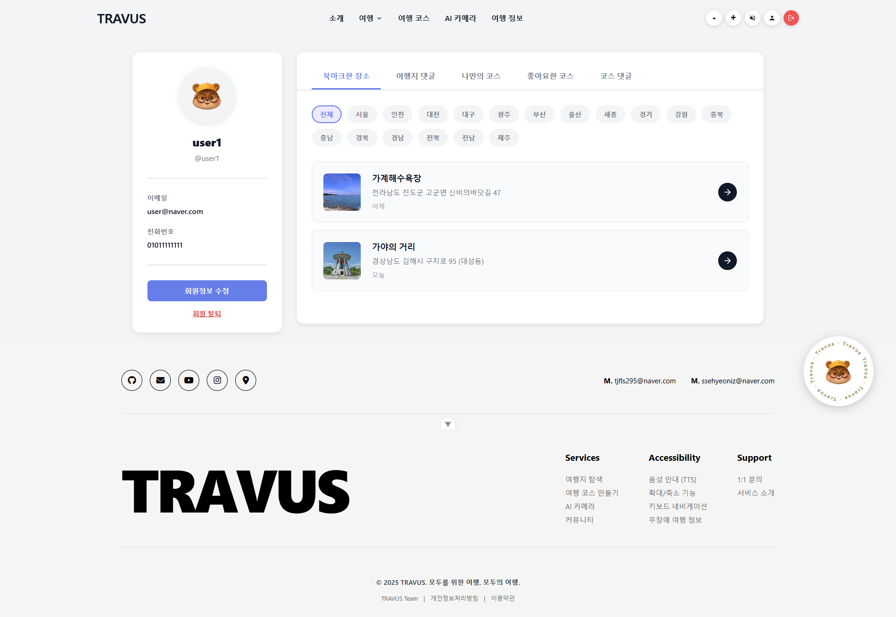
</p>

구현 포인트:

- JWT 로그인 상태 확인
- 사용자별 북마크 목록 조회
- 사용자 작성 리뷰 조회
- 내가 만든 코스 조회
- 좋아요한 코스 조회
- 코스 댓글 조회
- 회원 정보 수정 모달 제공

## 접근성 기능

TRAVUS는 서비스 주제에 맞게 사용자 인터페이스에도 접근성 기능을 반영했습니다.

- 글자 크기 확대 및 축소
- 설정값 `localStorage` 저장
- TTS(Text-to-Speech) 음성 안내
- 포커스된 버튼과 링크의 텍스트 읽기
- 키보드 포커스 스타일 제공
- 무장애 관광 정보 아이콘 시각화

## 기술 스택

### Frontend

<p>
  
  
  
  
  
  
  
  
  
</p>

| 기술 | 사용 목적 |
| --- | --- |
| Vue 3.5 | SPA 화면 구성 |
| Composition API | 상태와 로직을 컴포넌트 단위로 관리 |
| Vite 7.2 | 빠른 개발 서버 및 번들링 |
| Vue Router 4.6 | 페이지 라우팅 |
| Pinia 3.0 | 인증 상태 관리 |
| Axios 1.13 | 백엔드 API 통신 |
| GSAP 3.14 | 홈 화면 스크롤 애니메이션 |
| Kakao Map SDK | 지도, 마커, 동선 표시 |
| Web Speech API | TTS 음성 안내 |
| MediaRecorder API | 음성 질문 녹음 |

### Backend

<p>
  
  
  
  
  
  
  
  
</p>

| 기술 | 사용 목적 |
| --- | --- |
| Python 3.13 | 백엔드 개발 언어 |
| Django 5.2.4 | 서버 애플리케이션 |
| Django REST Framework 3.16.0 | REST API 구현 |
| SimpleJWT 5.3.1 | JWT 인증 |
| MySQL | 서비스 데이터 저장 |
| Redis 5.0.1 | 캐싱 확장 대비 |
| django-cors-headers 4.3.1 | 프론트엔드 CORS 허용 |
| python-dotenv 1.0.0 | 환경 변수 관리 |
| requests 2.32.4 | 외부 API 호출 |

### External API

<p>
  
  
  
  
  
  
  
</p>

| API | 사용 목적 |
| --- | --- |
| 한국관광공사 무장애 여행 API | 여행지 및 접근성 데이터 수집 |
| Kakao Map API | 지도 및 위치 표시 |
| OpenAI / SSAFY GMS | AI 코스 생성, 설명 생성, 후기 요약, 이미지 분석 |
| Whisper API | 음성 질문 STT 변환 |
| Naver Search API | 블로그, 뉴스 검색 |
| YouTube Data API | 여행 영상 검색 |

### Infra

<p>
  
  
  
</p>

| 기술 | 사용 목적 |
| --- | --- |
| AWS EC2 | 서버 배포 |
| MySQL | 운영 데이터베이스 |
| Redis | 캐싱 확장 대비 |

## 시스템 아키텍처

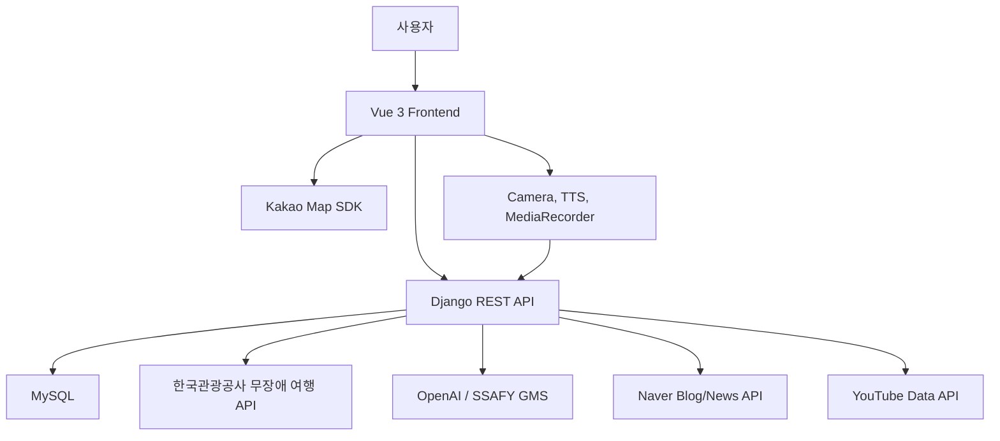

## 프로젝트 구조

```text
Travus
├─ README.md
├─ results
│  └─ images
│     └─ 서비스 화면 캡처 이미지
├─ Backend
│  ├─ manage.py
│  ├─ requirements.txt
│  ├─ travus
│  │  ├─ settings.py
│  │  ├─ urls.py
│  │  ├─ asgi.py
│  │  └─ wsgi.py
│  ├─ accounts
│  │  ├─ models.py
│  │  ├─ serializers.py
│  │  ├─ views.py
│  │  └─ urls.py
│  ├─ api
│  │  ├─ models.py
│  │  ├─ serializers.py
│  │  ├─ views.py
│  │  ├─ services
│  │  │  ├─ tour_api.py
│  │  │  ├─ ai_course_generator.py
│  │  │  └─ ai_description_generator.py
│  │  ├─ management
│  │  │  └─ commands
│  │  │     ├─ fetch_tour_data.py
│  │  │     ├─ load_api_data.py
│  │  │     ├─ sync_detail_info.py
│  │  │     └─ create_dummy_courses.py
│  │  └─ fixtures
│  │     └─ tour_data.json
│  ├─ ai
│  │  ├─ views.py
│  │  └─ urls.py
│  └─ board
│     ├─ views.py
│     └─ urls.py
└─ Frontend
   └─ travus
      ├─ package.json
      ├─ vite.config.js
      ├─ src
      │  ├─ main.js
      │  ├─ App.vue
      │  ├─ router
      │  │  └─ index.js
      │  ├─ stores
      │  │  └─ auth.js
      │  ├─ services
      │  │  ├─ api.js
      │  │  └─ boardApi.js
      │  ├─ composables
      │  │  └─ useTTS.js
      │  ├─ views
      │  │  ├─ Home.vue
      │  │  ├─ About.vue
      │  │  ├─ TravelView.vue
      │  │  ├─ TravelDetailView.vue
      │  │  ├─ CourseView.vue
      │  │  ├─ CameraView.vue
      │  │  ├─ BoardView.vue
      │  │  ├─ LoginView.vue
      │  │  ├─ SignupView.vue
      │  │  └─ MyPageView.vue
      │  ├─ components
      │  │  ├─ common
      │  │  ├─ home
      │  │  ├─ course
      │  │  ├─ travel
      │  │  ├─ ai
      │  │  └─ about
      │  └─ assets
      │     └─ 이미지 및 아이콘 리소스
      └─ public
```

## 한 줄 요약

TRAVUS는 단순한 여행지 검색 서비스가 아니라, 무장애 관광 데이터와 AI 기술을 결합해 **누구나 자신의 속도와 조건에 맞게 여행을 계획할 수 있도록 돕는 배리어프리 여행 플랫폼**입니다.
